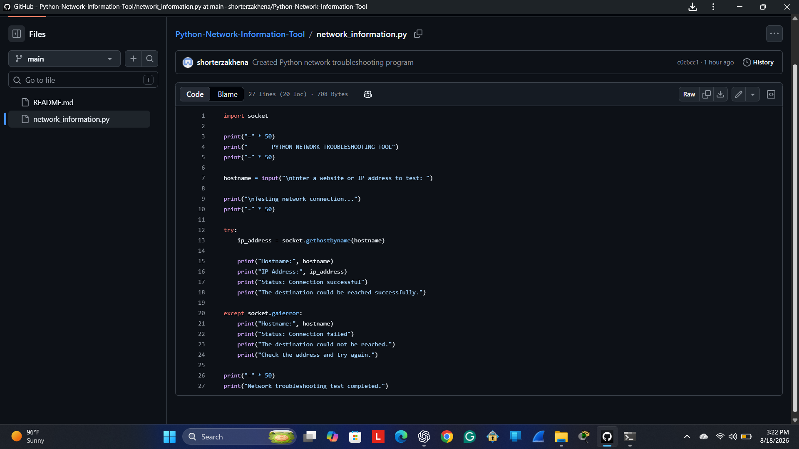
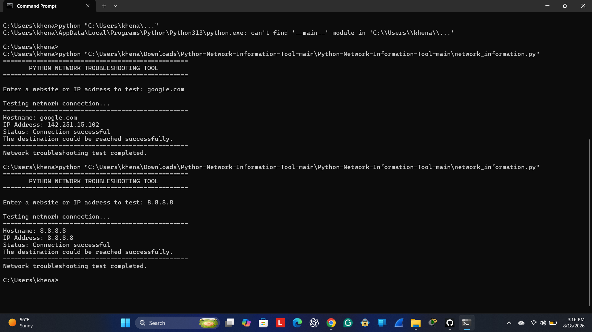
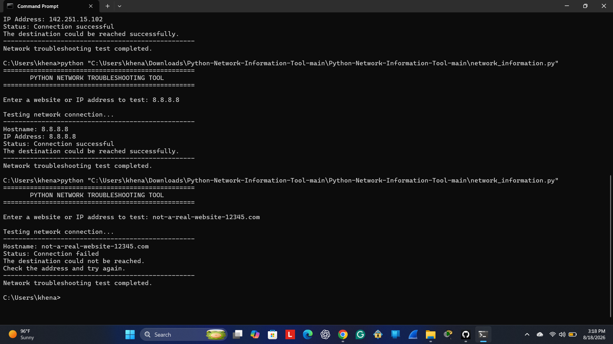

## Python-Network-Information-Tool

**Project Objective**

The goal of this project was to create a basic Python program that can test a website or IP address. I wanted to get more practice with Python and learn how it can be used for basic network troubleshooting.

**Project Description**

I created a Python program that allows the user to enter a website or IP address. The program checks the address and displays the IP address and connection status.

I tested the program with a valid IP address and an invalid website address to make sure it could handle both successful and failed results.

**Technologies Used**

- Python 3
- GitHub
- Windows Command Prompt
- Python Socket Module

**Skills Demonstrated**

- Python programming
- Basic networking
- Network troubleshooting
- User input
- Error handling
- Testing and troubleshooting
- Command Prompt
- GitHub

**How the Program Works**

1. The program asks the user to enter a website or IP address.
2. It uses the Python socket module to check the address.
3. If the address works, the program displays the IP address and a successful connection message.
4. If the address does not work, the program displays a connection failed message.
5. The program then lets the user know that the test is completed.

**Testing Results**

### Successful Test

**Input:** `8.8.8.8`

**Result:** Connection successful. The destination could be reached successfully.

**Failed Test**

**Input:** `not-a-real-website-12345.com`

**Result:** Connection failed. The program correctly handled the invalid address without crashing.

**Project Screenshots**

**Python Code**

**Successful IP Test**

### Failed Hostname Test

**What I Learned**

I learned how to create and run a basic Python program. I also learned how to use the socket module, accept user input, use error handling, and test a program using Command Prompt.

I also got more practice using GitHub to organize and document my work.

**Challenges and Solutions**

One of my biggest challenges was getting my Python file to run from Command Prompt. I had problems with the file location and the Python command. I was able to find the correct file path and get the program running successfully.

I also had to learn how to organize my project and screenshots on GitHub.

Author: Zakhena IT Professional | Recent IT Graduate

Author: Zakhena K.Shorter IT Professional | Recent IT Graduate
